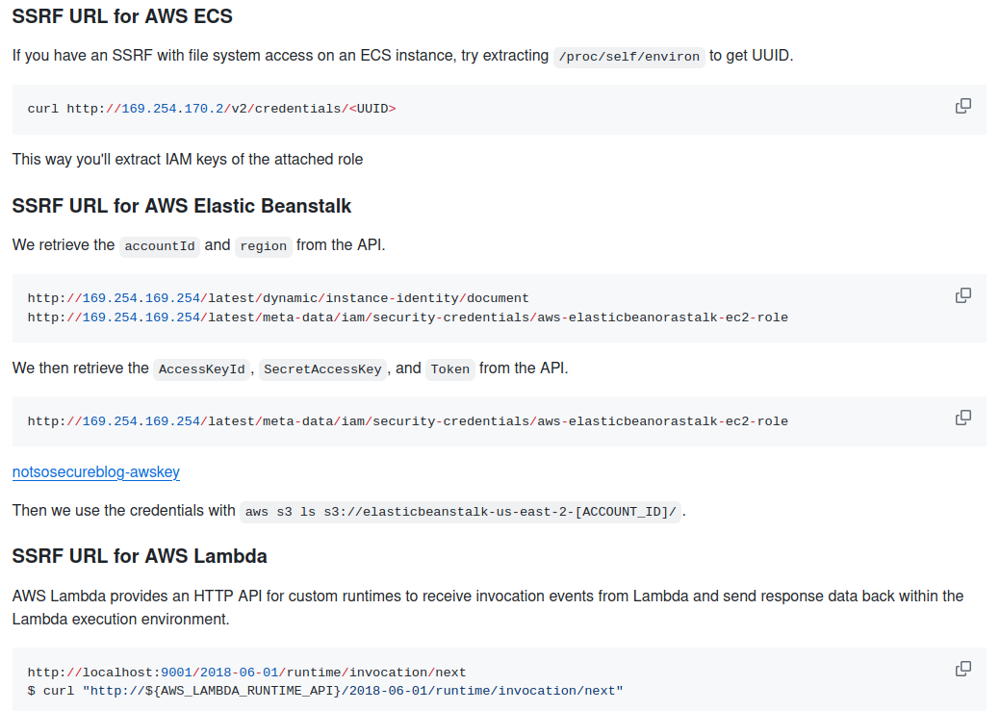
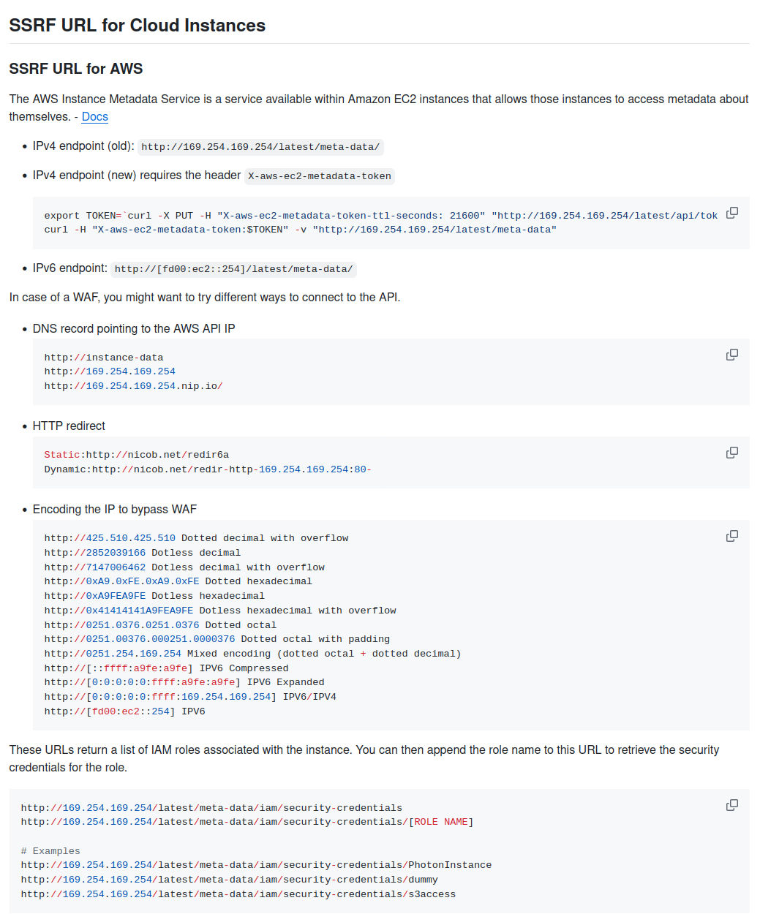
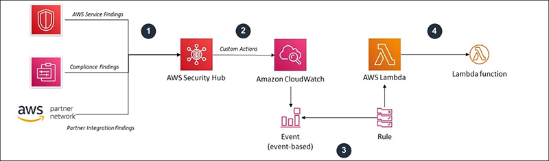
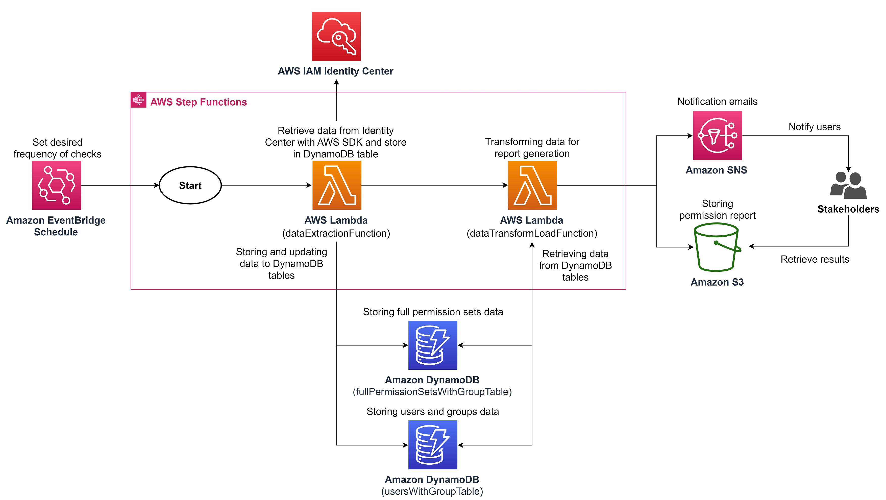
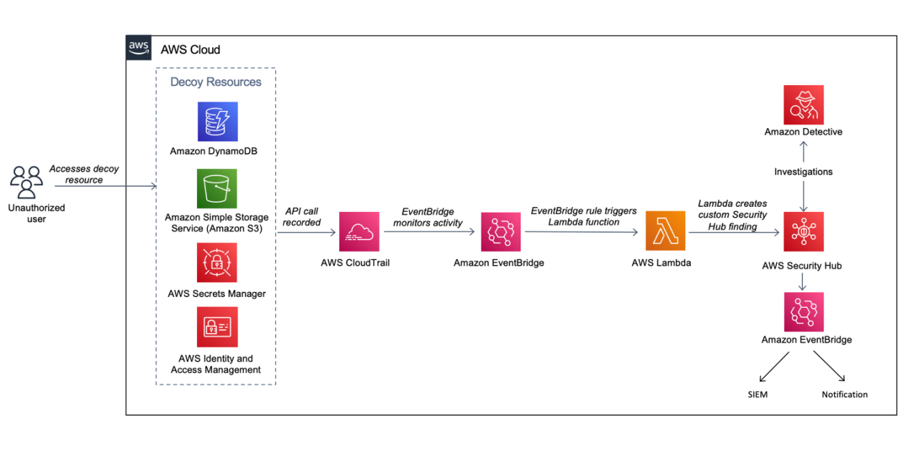

<!-- .slide: data-background="./_assets/img/bg.png"; data-state="hide-menubar"; -->
# 10 ways to \<redacted\> in a MultiCloud Environment

---
<!-- .slide: data-state="hide-menubar"; -->
## $ whoami

 👋 From Yucatán       
<!-- .element: class="fragment" -->

FLOSS (Debian since 2006) <!-- .element: class="fragment" -->

Cloud Security (AWS, GCP, Azure)
<!-- .element: class="fragment" -->

Lead Security Systems Engineer @ EPAM Systems <!-- .element: class="fragment" -->

---
<!-- .slide: data-state="hide-menubar"; -->
## 🗂️ Agenda

01. MultiCloud Security Situation<!-- .element: class="animate__flipInX" -->
02. SSRF Explotation<!-- .element: class="animate__flipInX" -->
03. Exposed Services<!-- .element: class="animate__flipInX" -->
04. Takerovers<!-- .element: class="animate__flipInX" -->
05. Overpermissive<!-- .element: class="animate__flipInX" -->
06. Until You Remember<!-- .element: class="animate__flipInX" -->
07. Secure Baseline<!-- .element: class="animate__flipInX" -->
08. Ownership<!-- .element: class="animate__flipInX" -->
09. Leaks<!-- .element: class="animate__flipInX" -->
10. Enforcement<!-- .element: class="animate__flipInX" -->
11. DevOps<!-- .element: class="animate__flipInX" -->

---
<!-- .slide: data-background="./_assets/img/bg.png"; data-state="hide-menubar"; data-name="Intro"; -->
## MultiCloud Security Situation

#### Challenges of a secure multi-cloud approach

---
### Quick Definition

> Cloud security is the set of cybersecurity measures used to protect cloud-based applications, data, and infrastructure.
>
> [https://cloud.google.com/learn/what-is-cloud-security](https://cloud.google.com/learn/what-is-cloud-security#section-2)

#### Cloud security;  <!-- .element: class="fragment" --> **Self Service**  <!-- .element: class="fragment highlight-blue" --> and **Flexible**?  <!-- .element: class="fragment highlight-blue" -->

---
<!-- .slide: data-background="./_assets/img/rocket-bug.webp"; data-background-size="10%"; data-background-position="5% 15%"; -->
### State of the Art

Source: [Current state of Cloud Security, CSHub 2023](https://www.cshub.com/cloud/reports/the-future-of-cloud-security)
<!-- .element: style="text-align: right;"-->

---
### Cloud Service Providers vs Misconfigurations

#### Why are we still failing so often?

[https://cloud.google.com/blog/products/identity-security/automatically-disabling-leaked-service-account-keys-what-you-need-to-know](https://cloud.google.com/blog/products/identity-security/automatically-disabling-leaked-service-account-keys-what-you-need-to-know)<!-- .element: class="fragment" -->

[https://docs.aws.amazon.com/securityhub/latest/userguide/fsbp-standard.html](https://docs.aws.amazon.com/securityhub/latest/userguide/fsbp-standard.html)<!-- .element: class="fragment" -->

---
#### Hey redteam

[https://hacktodef.com/addressed-aws-defaults-risks-oidc-terraform-and-anonymous-to-administratoraccess](https://hacktodef.com/addressed-aws-defaults-risks-oidc-terraform-and-anonymous-to-administratoraccess)

[https://unit42.paloaltonetworks.com/large-scale-cloud-extortion-operation/](https://unit42.paloaltonetworks.com/large-scale-cloud-extortion-operation/)

[https://ramimac.me/poisoning-ssm-command-docs](https://ramimac.me/poisoning-ssm-command-docs)

[https://dagrz.com/writing/aws-security/hacking-github-aws-oidc/](https://dagrz.com/writing/aws-security/hacking-github-aws-oidc/)

[https://www.scmagazine.com/news/critical-vulnerabilities-in-6-aws-services-disclosed-at-black-hat-usa](https://www.scmagazine.com/news/critical-vulnerabilities-in-6-aws-services-disclosed-at-black-hat-usa)

[https://medium.com/@adammesser_51095/cloud-digital-forensics-and-incident-response-aws-iam-privilege-escalation-leads-to-ec2-2d787a4e99a7](https://medium.com/@adammesser_51095/cloud-digital-forensics-and-incident-response-aws-iam-privilege-escalation-leads-to-ec2-2d787a4e99a7)

[https://blog.richardfan.xyz/2024/08/02/reusable-workflow-is-good-until-you-realize-your-identity-is-also-reusable-by-anyone.html ](https://blog.richardfan.xyz/2024/08/02/reusable-workflow-is-good-until-you-realize-your-identity-is-also-reusable-by-anyone.html )

[https://github.com/RyanJarv/awesome-cloud-sec](https://github.com/RyanJarv/awesome-cloud-sec)

---
<!-- .slide: data-background="./_assets/img/bg.png"; data-state="hide-menubar"; data-name="SSRF"; -->
## SSRF Explotation

#### 169.254.169.254, are you there?<!-- .element: class="fragment animate__flipInX" -->

---
### Server-Side Request Forgery

#### Which types of applications are vulnerable?

- Profile image loaders (often allowing users to specify a URL)
- Webhook services & external data processors
- PDF generators
- Unrestricted file uploads (via an XML file for example)
- CORS proxies (used to bypass CORS browser restrictions)
- Request header processing (such as the Host or X-Forwarded-For request header)

Source: https://blog.intigriti.com/hacking-tools/ssrf-a-complete-guide-to-exploiting-advanced-ssrf-vulnerabilities

---
### Abusing SSRF in ...

#### AWS, GCP, Azure, Docker, Rancher, K8s, Alibaba, Digital Ocean, IBM Cloud, etc ...

Source: https://github.com/swisskyrepo/PayloadsAllTheThings/blob/master/Server%20Side%20Request%20Forgery/README.md#ssrf-url-for-cloud-instances

---
### AWS EC2 Protection

#### Enable IMDSv2

> Note that if the EC2 instance is enforcing IMDSv2, according to the docs, the response of the PUT request will have a hop limit of 1, making impossible to access the EC2 metadata from a container inside the EC2 instance.
> 
> Moreover, IMDSv2 will also block requests to fetch a token that include the X-Forwarded-For header. This is to prevent misconfigured reverse proxies from being able to access it.

Source: https://docs.aws.amazon.com/AWSEC2/latest/UserGuide/instance-metadata-v2-how-it-works.html

---
<!-- .slide: data-background="./_assets/img/bg.png"; data-state="hide-menubar"; data-name="Exposed Services"; -->
## Exposed Services

#### Public buckets and more!<!-- .element: class="fragment animate__flipInX"  -->

---
### Behind public storage...

#### Many cloud services are public 

- Anyone can invoke my function?
- The image registries should be open?
- Anyone can publish/subscribe to your queue?
- Backups, snapshots can be wide open by mistake...

[https://github.com/SummitRoute/aws_exposable_resources](https://github.com/SummitRoute/aws_exposable_resources)

---
### Perform an inventory

#### Verify the configuration of each resource. 

Verification can be tedious, use automation tools to detect misconfigurations (static based like checkov, trivy, semgrep) or dynamic based on roles.

More info: https://cloud.hacktricks.xyz/pentesting-cloud/pentesting-cloud-methodology

---
<!-- .slide: data-background="./_assets/img/bg.png"; data-state="hide-menubar"; data-name="Takeovers"; -->
## Takerovers

#### Sorry, that was yours? :D<!-- .element: class="fragment animate__flipInX" -->

---
### You lease/delete an IP or a domain, but still has references

AWS S3 bucket  takeover
[https://infosecwriteups.com/aws-s3-subdomain-takeover-79d705cc3553](https://infosecwriteups.com/aws-s3-subdomain-takeover-79d705cc3553)

AWS EIP takeover
[https://zonduu.medium.com/the-secrets-behind-ec2-takeovers-706af7dfe86](https://zonduu.medium.com/the-secrets-behind-ec2-takeovers-706af7dfe86)

GCP Storage takeover (and more)
[https://hackerone.com/reports/1398706](https://hackerone.com/reports/1398706)

---

[https://aws.amazon.com/blogs/security/automated-response-and-remediation-with-aws-security-hub/](https://aws.amazon.com/blogs/security/automated-response-and-remediation-with-aws-security-hub/)

---
<!-- .slide: data-background="./_assets/img/bg.png"; data-state="hide-menubar"; data-name="Overpermissive"; -->
## Overpermissive

#### \*:\*<!-- .element: class="fragment animate__flipInX"  -->

---
### ConfusedFunction
#### Default SA is too powerful

This default Cloud Build service account gives the user excessive permissions. An attacker who gains access to create or update a Cloud Function can take advantage of the function’s deployment process to escalate privileges to the default Cloud Build service account.

The attacker could leverage the high privileges of the default Cloud Build service account in other GCP services that are created when a Cloud Function is created or updated, including Cloud Storage, and Artifact Registry or Container Registry.

Source: https://www.tenable.com/blog/confusedfunction-a-privilege-escalation-vulnerability-impacting-gcp-cloud-functions

---
### What about ReadOnlyAccess?

- cognito-identity:GetCredentialsForIdentity – Grants permission to return credentials for the provided identity ID. 
- cognito-identity:GetOpenIdToken – Grants permission to get an OpenID token, using a known Cognito ID. 
- cognito-identity:GetOpenIdTokenForDeveloperIdentity – Grants permission to register (or retrieve) a Cognito IdentityId and an OpenID Connect token for a user authenticated by your backend authentication process. 
- cognito-idp:GetSigningCertificate – Returns the signing certificate. 
- connect:GetFederationToken – Grants permission to federate into an Amazon Connect instance when using SAML-based authentication for identity management. 
- ec2:GetPasswordData – Grants permission to retrieve the encrypted administrator password for a running Windows instance. 
- ecr:GetAuthorizationToken – Grants permission to retrieve a token that is valid for a specified registry for 12 hours. 
- gamelift:GetInstanceAccess – Grants permission to request remote access to a specified fleet instance. 
- s3:GetObject – Grants permission to retrieve objects from Amazon S3. 
- ssm:GetParameter – Grants permission to view information about a specified parameter. 
- ssm:GetParameters – Grants permission to view information about multiple specified parameters. 
- ssm:GetParametersByPath – Grants permission to view information about parameters in a specified hierarchy. 
- sts:GetSessionToken – Grants permission to obtain a set of temporary security credentials (consisting of an access key ID, a secret access key, and a security token) for an AWS account or IAM user. 

[https://www.sidechannel.blog/en/unwanted-permissions-that-may-impact-security-when-using-the-readonlyaccess-policy-in-aws/](https://www.sidechannel.blog/en/unwanted-permissions-that-may-impact-security-when-using-the-readonlyaccess-policy-in-aws/)

---
### Least Privilege

Don't go forward to "*", start with some Get or List, if apply.

Use conditionals (AWS)

Create custom roles (GCP)

[https://repost.aws/knowledge-center/sqs-access-policy-least-privilege](https://repost.aws/knowledge-center/sqs-access-policy-least-privilege)
[https://aquasecurity.github.io/tfsec/v1.0.0/checks/aws/iam/no-policy-wildcards/ ](https://aquasecurity.github.io/tfsec/v1.0.0/checks/aws/iam/no-policy-wildcards/ )

---
<!-- .slide: data-background="./_assets/img/bg.png"; data-state="hide-menubar"; data-name="Until"; -->
## Until You Remember

#### Used 450 days ago. 800 days old.<!-- .element: class="fragment animate__flipInX" -->

---
### When was your last IAM Audit, Cloud Clean Up?

- Define an acceptable time of usage

- Remove console access if not needed
- Remove unused API keys
- Not used? Remove the account

- Remove roles that trusted by external sources if they are not used

- Remove accounts, projects or subscriptions you don’t use

- Verify the activity of the roles, is normal?
- Service accounts are normal?

- Are all the API calls normal? 
- Which is the most wanted API call? 
- Times for spikes are related to your operations?

[https://aws.amazon.com/blogs/security/how-to-automate-the-review-and-validation-of-permissions-for-users-and-groups-in-aws-iam-identity-center/](https://aws.amazon.com/blogs/security/how-to-automate-the-review-and-validation-of-permissions-for-users-and-groups-in-aws-iam-identity-center/)

---
<!-- .slide: data-background="./_assets/img/bg.png"; data-state="hide-menubar"; data-name="Secure Baseline"; -->
## Secure Baseline

#### Copy & Paste<!-- .element: class="fragment animate__flipInX"  -->

---
### How are your accounts, projects and subscriptions created?

- Security service accounts
- Breaking glass scenario
- Hardening
- Monitoring
- Evaluate one, fix multiple
- Made security easy to adopt at Org Level
- Defines a base cost for security

---
<!-- .slide: data-background="./_assets/img/bg.png"; data-state="hide-menubar"; data-name="Ownership"; -->
## Ownership

#### He/She is not working at the company anymore.<!-- .element: class="fragment animate__flipInX" -->

---
### When things goes wrong? Who we are gonna call?

- Metadata
  - Project
  - Service
  - Owners
  - Team
  - Env
  - Etc..

- Problems
  - AWS Tags vs GCP Labels
  - Operations vs Developers
  - Communication channels

---
<!-- .slide: data-background="./_assets/img/bg.png"; data-state="hide-menubar"; data-name="Leaks"; -->
## Leaks

#### Oh no ...<!-- .element: class="fragment animate__flipInX" -->

---

[https://aws.amazon.com/blogs/security/how-to-detect-suspicious-activity-in-your-aws-account-by-using-private-decoy-resources/](https://aws.amazon.com/blogs/security/how-to-detect-suspicious-activity-in-your-aws-account-by-using-private-decoy-resources/)

---
<!-- .slide: data-background="./_assets/img/bg.png"; data-state="hide-menubar"; data-name="Enforcement"; -->
## Enforcement

#### Cloud security policies everywhere<!-- .element: class="fragment animate__flipInX"  -->

---
### They call it: Killer Bot

Detect changes on the environments, cross the cloud or inner the cloud. Someone tried to spin up a new instance without following the business practices or a new bucket is exposed without an explanation.

Destroy them, disable them, avoid the risk while is sooner and sent the team owner a notification with the explanation.

Detection could happen during a code change (PR) or during the interaction in the console (live)

More info: https://github.com/hysnsec/awesome-policy-as-code

---
<!-- .slide: data-background="./_assets/img/bg.png"; data-state="hide-menubar"; data-name="DevOps"; -->
## DevOps

#### R.O.S.I.<!-- .element: class="fragment animate__flipInX" -->

---
### DevSecOps is a cultural reminder that security is always there.

---
<!-- .slide: data-state="hide-menubar"; -->
## Thank you!
#### Questions?

<!-- .element style="border: 0; background: None; box-shadow: None" width="72%" -->
