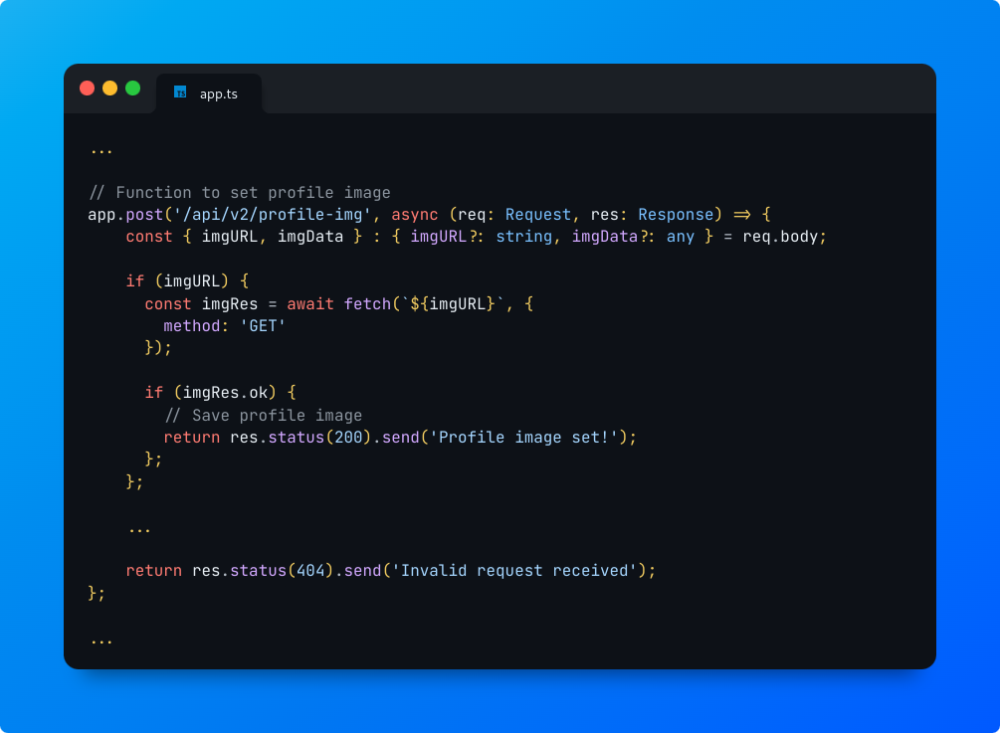
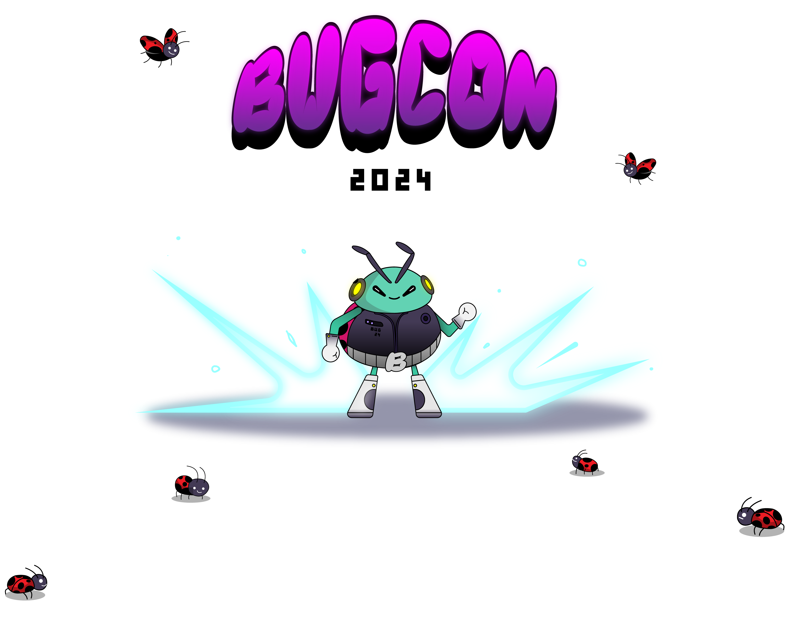

<!-- .slide: data-background="./_assets/img/bg.png"; data-state="hide-menubar"; -->
# 10 ways to \<redacted\> in a MultiCloud Environment

---
<!-- .slide: data-state="hide-menubar"; -->
## $ whoami

 👋 From Yucatán       
<!-- .element: class="fragment" -->

FLOSS (Debian since 2006) <!-- .element: class="fragment" -->

Cloud Security (AWS, GCP, Azure)
<!-- .element: class="fragment" -->

Lead Security Systems Engineer @ EPAM Systems <!-- .element: class="fragment" -->

---
<!-- .slide: data-state="hide-menubar"; -->
## 🗂️ Agenda

01. MultiCloud Security Situation
02. SSRF Explotation
03. Exposed Services
04. Takerovers
05. Overpermissive
06. Until You Remember
07. Secure Baseline
08. Ownership
09. Leaks
10. Enforcement
11. DevOps

---
<!-- .slide: data-background="./_assets/img/bg.png"; data-state="hide-menubar"; data-name="Intro"; -->
## MultiCloud Security Situation

#### Challenges of a secure multi-cloud approach

---
### Quick Definition

> Cloud security is the set of cybersecurity measures used to protect cloud-based applications, data, and infrastructure.
>
> [https://cloud.google.com/learn/what-is-cloud-security](https://cloud.google.com/learn/what-is-cloud-security#section-2)

#### Cloud security;  <!-- .element: class="fragment" --> **Self Service**  <!-- .element: class="fragment highlight-blue" --> and **Flexible**?  <!-- .element: class="fragment highlight-blue" -->

---
<!-- .slide: data-background="./_assets/img/rocket-bug.webp"; data-background-size="10%"; data-background-position="5% 15%"; -->
### State of the Art

Source: [Current state of Cloud Security, CSHub 2023](https://www.cshub.com/cloud/reports/the-future-of-cloud-security)
<!-- .element: style="text-align: right;"-->

---
<!-- .slide: data-background="./_assets/img/bg.png"; data-state="hide-menubar"; data-name="SSRF"; -->
## SSRF Explotation

#### 169.254.169.254, are you there?<!-- .element: class="fragment" -->

---
### Server-Side Request Forgery

#### Which types of applications are vulnerable?

- Profile image loaders (often allowing users to specify a URL)
- Webhook services & external data processors
- PDF generators
- Unrestricted file uploads (via an XML file for example)
- CORS proxies (used to bypass CORS browser restrictions)
- Request header processing (such as the Host or X-Forwarded-For request header)

Source: https://blog.intigriti.com/hacking-tools/ssrf-a-complete-guide-to-exploiting-advanced-ssrf-vulnerabilities

---
<!-- .slide: data-background="./_assets/img/bg.png"; data-state="hide-menubar"; data-name="Exposed Services"; -->
## Exposed Services

#### Public buckets and more!<!-- .element: class="fragment" -->

---
<!-- .slide: data-background="./_assets/img/bg.png"; data-state="hide-menubar"; data-name="Takeovers"; -->
## Takerovers

#### Sorry, that was yours? :D<!-- .element: class="fragment" -->

---
<!-- .slide: data-background="./_assets/img/bg.png"; data-state="hide-menubar"; data-name="Overpermissive"; -->
## Overpermissive

#### \*:\*<!-- .element: class="fragment" -->

---
<!-- .slide: data-background="./_assets/img/bg.png"; data-state="hide-menubar"; data-name="Until"; -->
## Until You Remember

#### Used 450 days ago. 800 days old.<!-- .element: class="fragment" -->

---
<!-- .slide: data-background="./_assets/img/bg.png"; data-state="hide-menubar"; data-name="Secure Baseline"; -->
## Secure Baseline

#### Copy & Paste<!-- .element: class="fragment" -->

---
<!-- .slide: data-background="./_assets/img/bg.png"; data-state="hide-menubar"; data-name="Ownership"; -->
## Ownership

#### He/She is not working at the company anymore.<!-- .element: class="fragment" -->

---
<!-- .slide: data-background="./_assets/img/bg.png"; data-state="hide-menubar"; data-name="Leaks"; -->
## Leaks

#### Oh no ...<!-- .element: class="fragment" -->

---
<!-- .slide: data-background="./_assets/img/bg.png"; data-state="hide-menubar"; data-name="Enforcement"; -->
## Enforcement

#### Cloud security policies everywhere<!-- .element: class="fragment" -->

---
### They call it: Killer Bot

Detect changes on the environments, cross the cloud or inner the cloud. Someone tried to spin up a new instance without following the business practices or a new bucket is exposed without an explanation.

Destroy them, disable them, avoid the risk while is sooner and sent the team owner a notification with the explanation.

Detection could happen during a code change (PR) or during the interaction in the console (live)

More info: https://github.com/hysnsec/awesome-policy-as-code

---
<!-- .slide: data-background="./_assets/img/bg.png"; data-state="hide-menubar"; data-name="DevOps"; -->
## DevOps

#### R.O.S.I.<!-- .element: class="fragment" -->

---
### DevSecOps is a cultural reminder that security is always there.

---
<!-- .slide: data-state="hide-menubar"; -->
## Thank you!
#### Questions?

<!-- .element style="border: 0; background: None; box-shadow: None" width="72%" -->
