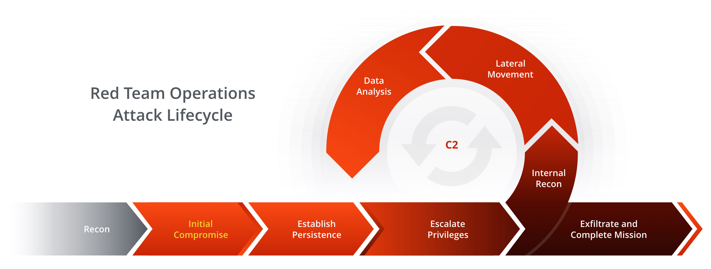

<!-- .slide: data-background="./img/portada.jpg"; data-background-opacity="0.75";-->
## Mi primer Pentest
#### Tony Palma

---
### $ whoami
- Ing en Computación, 2006-2011
- FLOSS (Debian)
- ex-CTF Player (Reverse Engineering y Malware Analyst)
- Café y Cervezas Artesanales
- Lead Security Systems Engineer at EPAM SYSTEMS

---
### Agenda
* ¿Qué son las pruebas de penetración?
* ¿Porqué son imporantes para la seguridad ofensiva?
* ¿Cómo puedo aprender a realizar pruebas de penetración?
* Donde practicar y aprender: HackTheBox, TryHackMe, VulnHub
* Comunidades

---
<!-- .slide: data-background="./img/titles.png"; -->
### Me gustaría...
Transmitirles la forma de pensar de un atacante

La emocion de descubrir la (in)seguridad de la tecnologia

Escuchar sus preguntas, y en la medida de lo posible, poderles contestar o orientar en la respuesta

---
### Hercules

<audio controls data-autoplay src="hercules.mp3"></audio>

Twitter: @_H3rcul3s

---
<!-- .slide: data-background="./img/titles.png"; -->
## ¿Qué son las pruebas de penetración?

---
### Wikipedia 
> Una *prueba de penetración*, o *pentest*, es un ataque a un sistema informático con la intención de encontrar las debilidades de seguridad y todo lo que podría tener acceso a ella, su funcionalidad y datos. El proceso consiste en identificar el o los sistemas del objetivo.

----
> Las pruebas de penetración pueden hacerse sobre una "caja blanca" (donde se ofrece toda la información de fondo y de sistema) o caja negra (donde no se proporciona información, excepto el nombre de la empresa). Una prueba de penetración puede ayudar a determinar si un sistema es vulnerable a los ataques, si las defensas (si las hay) son suficientes y no fueron vencidas.

---
### National Cyber Security Center (UK)
> A method for gaining assurance in the security of an IT system by attempting to breach some or all of that systems security, using the same tools and techniques as an adversary might.

---
### Mis comentarios

* Ataque simulado (no destructivo ni restrictivo)
* Acuerdo Previo (Contrato (SOW) y Acuerdo de confidencialidad (NDA))
* Las empresas establecen que y cuando se realizan las pruebas
* Los planes de contingencia corren por parte del cliente que acepta el riesgo de las pruebas

---
### Metodologías

1. OWASP Testing Guide (4.1)
2. Penetration Testing Execution Standard (PTES)
3. Open Source Security Testing Methodology Manual (OSSTMM)
4. Information System Security Assessment Framework (ISSAF)
5. NIST 800-115, Technical Guide to Information Security Testing and Assessment

---
### Tipos de Pruebas
* Caja Negra
* Caja Blanca (transparente)
* Caja "Gris"

---
### PTES - Fases de un pentesting
* Pre-engagement Interactions
* Intelligence Gathering
* Threat Modeling
* Vulnerability Analysis
* Exploitation
* Post Exploitation
* Reporting

---
### Red Team Operations Attack Lifecycle

---
### BDrag0n

<audio data-autoplay controls src="bdragon.ogg"></audio>

Twitter: @BDrag0n_x

---
<!-- .slide: data-background="./img/titles.png"; -->
## ¿Porqué son importantes para la seguridad ofensiva?

---
### Las haciendas de la seguridad
* Cloud Security
* Application Security
* Physical Security
* Infraestructure Security
* Human Security
* Business Security

---
### Seguridad Ofensiva (Tech Target)
> Offensive security is a proactive and adversarial approach to protecting computer systems, networks and individuals from attacks. Conventional security -- sometimes referred to as "defensive security" -- focuses on reactive measures, such as patching software and finding and fixing system vulnerabilities.

----

> In contrast, offensive security measures are focused on seeking out the perpetrators and in some cases attempting to disable or at least disrupt their operations.

---
### Mis comentarios
La seguridad ofensiva integra los ejercicios de Pruebas de Penetración como una herramienta más que ayuda a la simulacion de adversario, modelado de amenazas, busqueda y explotacion de vulnerabilidades, y a la respuesta a incidentes entre otras actividades.

---
### Cumplimiento de Controles, Normas y Politicas
* Industrias (militar, financiera y de salud)
* Estandares 
* $$$

---
### theBlazz3

<audio data-autoplay controls src="theblazze.ogg"></audio>

Twitter: @theBlazz3

---
<!-- .slide: data-background="./img/titles.png"; -->
## ¿Cómo puedo aprender a realizar pruebas de penetración?

---
## TLTR; Leyendo y practicando todos los dias

---
### Capture The Flag (CTF)

* Ingenieria Inversa
* Web
* Explotacion de binarios y servicios
* Criptografia
* Forense
* Esteganografia
* Hardware

----
P.D. Si quieren formar un equipo, con gusto soy su mentor.

---
### "Como"
* Cuarto oscuro
* Disciplina
* Cultiva tu curiosidad
* Tolerancia a la frustración
* Documenta, escribe, publica.

---
### T-Bon3

<audio data-autoplay controls src="tbone.ogg"></audio>

Twitter: @oficialTBon3

---
<!-- .slide: data-background="./img/titles.png"; -->
## Donde practicar y aprender: HackTheBox, TryHackMe, VulnHub

---
### Hack The Box (HTB)

---
### Try Hack Me (THM)

---
### Vulnhub

---
### th3d00msl4y3r

<audio data-autoplay controls src="thedoomslayer.ogg"></audio>

telegram: @th3d00msl4y3r

---
<!-- .slide: data-background="./img/titles.png"; -->
## Comunidades

---
### México
* Hackthebox Mexico (Telegram)
* Rogue Security (Discord)
* NoTrustSec (Meetup)
* TPX (Telegram)

---
### Latinoamerica / España
* Latin Hackthebox (Telegram)
* CrackLatinos (Telegram)
* Hackplayers (Telegram)
* Follow the White Rabbit (Telegram)

---
## Muchas gracias por asistir
#### ¿Preguntas?

###### Antonio underscore Palma at Epam dot Com
###### @xbytemx
