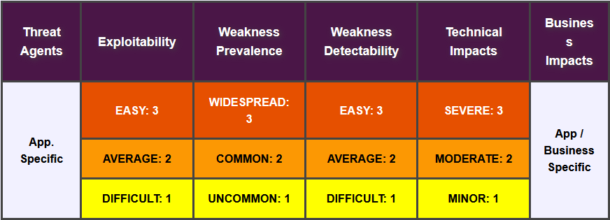

## OWASP Top 10 2021
### Tony Palma

---
### Agenda

{01} Introduction

{02} What's changed?

{03} A01:2021-Broken Access Control

{04} A02:2021-Cryptographic Failures

{05} A03:2021-Injection

{06} A04:2021-Insecure Design

{07} A05:2021-Security Misconfiguration

---
### Agenda


{08} A06:2021-Vulnerable and Outdated Components

{09} A07:2021-Identification and Authentication Failures

{10} A08:2021-Software and Data Integrity Failures

{11} A09:2021-Security Logging and Monitoring Failures

{12} A10:2021-Server-Side Request Forgery

---
<!-- .slide: data-background="./img/titles.png"; -->
## Introduction

---
### What is OWASP?

> OWASP - Open Web Application Security Project

- Nonprofit foundation (20+ years)
- Community-led open source software projects
- Over 200+ local chapters worldwide
- Tens of thousands of members
- Industry-leading educational and training conferences

---
### What is OWASP Top 10?

> The OWASP Top 10 is a book/referential document outlining the 10 most critical security concerns for web application security. The report is put together by a team of security experts from all over the world and the data comes from a number of organisations and is then analysed.

---
### The data

**Sources:** security vendors and consultancies, bug bounties, along with company/organizational contributions

**Format:** CSV, XLSX

**Common Weakness Enumeration (CWE):** A list of CWEs w/ count of applications found to contain that CWE

> [Data of 2021 Edition](https://github.com/OWASP/Top10/tree/master/2021)

---
### GitLab 2020 Submission Example

|scanner  |CWE    |projects_vulnerable|projects_tested|timeframe|contributor_email|contributor_name|
|---------|-------|-------------------|---------------|---------|-----------------|----------------|
|container|CWE-787|4426               |4943           |2020     |whaber@gitlab.com|Wayne Haber     |
|container|CWE-20 |3934               |4943           |2020     |whaber@gitlab.com|Wayne Haber     |
|container|CWE-119|3917               |4943           |2020     |whaber@gitlab.com|Wayne Haber     |
|container|CWE-125|3707               |4943           |2020     |whaber@gitlab.com|Wayne Haber     |
|container|CWE-190|3571               |4943           |2020     |whaber@gitlab.com|Wayne Haber     |
|container|CWE-400|3283               |4943           |2020     |whaber@gitlab.com|Wayne Haber     |
|container|CWE-200|3049               |4943           |2020     |whaber@gitlab.com|Wayne Haber     |
|container|CWE-416|2827               |4943           |2020     |whaber@gitlab.com|Wayne Haber     |
|container|CWE-617|2445               |4943           |2020     |whaber@gitlab.com|Wayne Haber     |
|container|CWE-59 |2159               |4943           |2020     |whaber@gitlab.com|Wayne Haber     |
|container|CWE-120|2114               |4943           |2020     |whaber@gitlab.com|Wayne Haber     |
|container|CWE-476|2091               |4943           |2020     |whaber@gitlab.com|Wayne Haber     |
<!-- .element: class="stretch" style="font-size: 0.50em !important;" -->

---
### Top of CWE

> As organizations and people work toward submitting data for the Top 10 project, one of the pieces that can be difficult is mapping our findings to the CWE list. The list below is an attempt to gather sample lists of CWEs related to Top 10-like vulnerabilities to ease the collation of data. 

---
### CWE ID (1/5)

CWE ID	| CWE Name
------------ | -------------
20 | Improper Input Validation
22 | Improper Limitation of a Pathname to a Restricted Directory ('Path Traversal')
77 | Improper Neutralization of Special Elements used in a Command ('Command Injection')
78 | Improper Neutralization of Special Elements used in an OS Command ('OS Command Injection')
79 | Improper Neutralization of Input During Web Page Generation ('Cross-site Scripting')
88 | Improper Neutralization of Argument Delimiters in a Command ('Argument Injection')
89 | Improper Neutralization of Special Elements used in an SQL Command ('SQL Injection')
90 | Improper Neutralization of Special Elements used in an LDAP Query ('LDAP Injection')
91 | XML Injection (aka Blind XPath Injection)
94 | Improper Control of Generation of Code ('Code Injection')
119 | Improper Restriction of Operations within the Bounds of a Memory Buffer
125	| Out-of-bounds Read
190	| Integer Overflow or Wraparound
<!-- .element: class="stretch" style="font-size: 0.50em !important;" -->

---
### CWE ID (2/5)

CWE ID	| CWE Name
------------ | -------------
200	| Exposure of Sensitive Information to an Unauthorized Actor
209	| Generation of Error Message Containing Sensitive Information
220	| Storage of File With Sensitive Data Under FTP Root
223	| Omission of Security-relevant Information
256	| Unprotected Storage of Credentials
269	| Improper Privilege Management
284	| Improper Access Control
285	| Improper Authorization
287	| Improper Authentication
295	| Improper Certificate Validation
308	| Use of Single-factor Authentication
311	| Missing Encryption of Sensitive Data
312	| Cleartext Storage of Sensitive Information
319	| Cleartext Transmission of Sensitive Information
325	| Missing Required Cryptographic Step
<!-- .element: class="stretch" style="font-size: 0.50em !important;" -->

---
### CWE ID (3/5)

CWE ID	| CWE Name
------------ | -------------
326	| Inadequate Encryption Strength
327	| Use of a Broken or Risky Cryptographic Algorithm
328	| Reversible One-Way Hash
346	| Origin Validation Error
352	| Cross-Site Request Forgery (CSRF)
359	| Exposure of Private Personal Information to an Unauthorized Actor
384	| Session Fixation
400	| Uncontrolled Resource Consumption
416	| Use After Free
425	| Direct Request ('Forced Browsing')
426	| Untrusted Search Path
434	| Unrestricted Upload of File with Dangerous Type
476	| NULL Pointer Dereference
502	| Deserialization of Untrusted Data
521	| Weak Password Requirements
<!-- .element: class="stretch" style="font-size: 0.50em !important;" -->

---
### CWE ID (4/5)

CWE ID	| CWE Name
------------ | -------------
522	| Insufficiently Protected Credentials
523	| Unprotected Transport of Credentials
548	| Exposure of Information Through Directory Listing
564	| SQL Injection: Hibernate
601	| URL Redirection to Untrusted Site ('Open Redirect')
611	| Improper Restriction of XML External Entity Reference
613	| Insufficient Session Expiration
614	| Sensitive Cookie in HTTPS Session Without 'Secure' Attribute
620	| Unverified Password Change
639	| Authorization Bypass Through User-Controlled Key
640	| Weak Password Recovery Mechanism for Forgotten Password
650	| Trusting HTTP Permission Methods on the Server Side
732	| Incorrect Permission Assignment for Critical Resource
772	| Missing Release of Resource after Effective Lifetime
776	| Improper Restriction of Recursive Entity References in DTDs ('XML Entity Expansion')
<!-- .element: class="stretch" style="font-size: 0.50em !important;" -->

---
### CWE ID (5/5)

CWE ID	| CWE Name
------------ | -------------
778	| Insufficient Logging
787	| Out-of-bounds Write
798	| Use of Hard-coded Credentials
917	| Improper Neutralization of Special Elements used in an Expression Language Statement ('Expression Language Injection')
943	| Improper Neutralization of Special Elements in Data Query Logic
1021	| Improper Restriction of Rendered UI Layers or Frames
1216	| Lockout Mechanism Errors
<!-- .element: class="stretch" style="font-size: 0.50em !important;" -->

---
### Application Security Risks


---
### OWASP Risk Rating Methodology




---
### Data factors

**CWEs Mapped:** The number of CWEs mapped to a category by the Top 10 team.

**Incidence Rate:** Incidence rate is the percentage of applications vulnerable to that CWE from the population tested by that org for that year.

**(Testing) Coverage:** The percentage of applications tested by all organizations for a given CWE.

**Total CVEs:** Total number of CVEs in the NVD DB that were mapped to the CWEs mapped to a category.

---
### Data factors

**Weighted Exploit:** The Exploit sub-score from CVSSv2 and CVSSv3 scores assigned to CVEs mapped to CWEs, normalized, and placed on a 10pt scale.

**Weighted Impact:** The Impact sub-score from CVSSv2 and CVSSv3 scores assigned to CVEs mapped to CWEs, normalized, and placed on a 10pt scale.

**Total Occurrences:** Total number of applications found to have the CWEs mapped to a category.

---
<!-- .slide: data-background="./img/titles.png"; -->
## What's changed ?

---
### More data-driven than ever

- 8 categories from contributed data and 2 categories from industry survey
- From 30 CWE baseline to 400 CWE. Focus on root cause over the symptom.
- Categories: Exploitability, Detectability (also likelihood), and Technical Impact (2017) and Exploitability and Impact (2021). Incidence rate instead of frequency

---
### Top 10 from 2017 to 2021?


---
### Category Relationships from 2017

XSS -> Content Injection -> Injection

Overlaping only in one direction (sympton)


---
<!-- .slide: data-background="./img/titles.png"; -->
## A01:2021-Broken Access Control

---
### A01:2021-Broken Access Control

> Access control enforces policy such that users cannot act outside of their intended permissions. Failures typically lead to unauthorized information disclosure, modification, or destruction of all data or performing a business function outside the user's limits. **34 CWE mapped.**
<!-- .element: class="stretch" style="font-size: 1em !important;" -->

---
### A01:2021-Broken Access Control

- CWE-200: Exposure of Sensitive Information to an Unauthorized Actor
- CWE-201: Exposure of Sensitive Information Through Sent Data
- CWE-352: Cross-Site Request Forgery

---
### A01:2021-Broken Access Control

**Scenario #1:** The application uses unverified data in a SQL call that is accessing account information

**Scenario #2:** An attacker simply forces browses to target URLs. Admin rights are required for access to the admin page

---
<!-- .slide: data-background="./img/titles.png"; -->
## A02:2021-Cryptographic Failures

---
### A02:2021-Cryptographic Failures

> The focus is on failures related to cryptography (or lack thereof), which often lead to exposure of sensitive data. (randomness, deprecated hash functions, nitialization vectors ignored, reused, or not generated sufficiently secure, encryption not enforced, etc) **29 CWE mapped.**
<!-- .element: class="stretch" style="font-size: 1em !important;" -->

---
### A02:2021-Cryptographic Failures

- CWE-259: Use of Hard-coded Password
- CWE-327: Broken or Risky Crypto Algorithm
- CWE-331: Insufficient Entropy

---
### A02:2021-Cryptographic Failures

**Scenario #1:** An application encrypts credit card numbers in a database using automatic database encryption. However, this data is automatically decrypted when retrieved, allowing a SQL injection flaw to retrieve credit card numbers in clear text.

**Scenario #2:** The password database uses unsalted or simple hashes to store everyone's passwords. A file upload flaw allows an attacker to retrieve the password database. All the unsalted hashes can be exposed with a rainbow table.

---
<!-- .slide: data-background="./img/titles.png"; -->
## A03:2021-Injection

---
### A03:2021-Injection

> Some of the more common injections are SQL, NoSQL, OS command, Object Relational Mapping (ORM), LDAP, and Expression Language (EL) or Object Graph Navigation Library (OGNL) injection. The concept is identical among all interpreters. Source code review is the best method of detecting if applications are vulnerable to injections. Automated testing of all parameters, headers, URL, cookies, JSON, SOAP, and XML data inputs is strongly encouraged. **33 CWE mapped.**
<!-- .element: class="stretch" style="font-size: 1em !important;" -->

---
### A03:2021-Injection

- CWE-79: Cross-site Scripting
- CWE-89: SQL Injection
- CWE-73: External Control of File Name or Path

---
### A03:2021-Injection

**Scenario #1:** An application uses untrusted data in the construction of the following vulnerable SQL call:

```bash
String query = "SELECT \* FROM accounts WHERE custID='" + request.getParameter("id") + "'";
```

**Scenario #2:** Similarly, an application’s blind trust in frameworks may result in queries that are still vulnerable, (e.g., Hibernate Query Language (HQL)):

```bash
Query HQLQuery = session.createQuery("FROM accounts WHERE custID='" + request.getParameter("id") + "'");
```

---
<!-- .slide: data-background="./img/titles.png"; -->
## A04:2021-Insecure Design

---
### A04:2021-Insecure Design

> Insecure design is a broad category representing different weaknesses, expressed as “missing or ineffective control design. A secure design can still have implementation defects leading to vulnerabilities that may be exploited. An insecure design cannot be fixed by a perfect implementation as by definition, needed security controls were never created to defend against specific attacks. **40 CWE mapped.**
<!-- .element: class="stretch" style="font-size: 1em !important;" -->

---
### A04:2021-Insecure Design

- CWE-209: Generation of Error Message Containing Sensitive Information
- CWE-256: Unprotected Storage of Credentials
- CWE-501: Trust Boundary Violation
- CWE-522: Insufficiently Protected Credentials

---
### A04:2021-Insecure Design

**Scenario #1:** A cinema chain allows group booking discounts and has a maximum of fifteen attendees before requiring a deposit. Attackers could threat model this flow and test if they could book six hundred seats and all cinemas at once in a few requests, causing a massive loss of income.

---
<!-- .slide: data-background="./img/titles.png"; -->
## A05:2021-Security Misconfiguration

---
### A05:2021-Security Misconfiguration

> Missing appropriate security hardening across any part of the application stack or improperly configured permissions on cloud services, default accounts and their passwords are still enabled and unchanged, error handling reveals stack traces or other overly informative error messages to users, the software is out of date or vulnerable, etc **20 CWE mapped.**
<!-- .element: class="stretch" style="font-size: 1em !important;" -->

---
### A05:2021-Security Misconfiguration

- CWE-16 Configuration
- CWE-611 Improper Restriction of XML External Entity Reference

---
### A05:2021-Security Misconfiguration


**Scenario #1:** Directory listing is not disabled on the server. An attacker discovers they can simply list directories. The attacker finds and downloads the compiled Java classes, which they decompile and reverse engineer to view the code. The attacker then finds a severe access control flaw in the application.

**Scenario #2:** A cloud service provider has default sharing permissions open to the Internet by other Content Security Policy header (CSP) users. This allows sensitive data stored within cloud storage to be accessed.
<!-- .element: class="stretch" style="font-size: 1em !important;" -->

---
<!-- .slide: data-background="./img/titles.png"; -->
## A06:2021-Vulnerable and Outdated Components

---
<!-- .slide: data-background="./img/titles.png"; -->
## A07:2021-Identification and Authentication Failures

---
<!-- .slide: data-background="./img/titles.png"; -->
## A08:2021-Software and Data Integrity Failures

---
<!-- .slide: data-background="./img/titles.png"; -->
## A09:2021-Security Logging and Monitoring Failures

---
<!-- .slide: data-background="./img/titles.png"; -->
## A10:2021-Server-Side Request Forgery

---
<!-- .slide: data-background="./img/titles.png"; -->
### Thank you!
