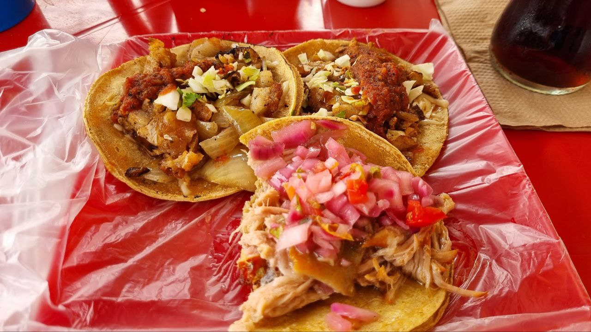

<!-- .slide: data-background="./img/cover.jpg"; -->
## sudo make deploy-cloudsec
#### Tony Palma


---
### $ whoami

<div> 👋 From Yucatán <BR>     </div><!-- .element: class="fragment" -->

FLOSS (Debian since 2006) <!-- .element: class="fragment" -->

Cloud Security (AWS, GCP, Azure)</div><!-- .element: class="fragment" -->

Lead Security Systems Engineer @ EPAM Systems <!-- .element: class="fragment" -->


---
### 🗂️ Agenda (1/2)

- **Cloud Security** (surprise!)
- The value of the *low-hanging* fruits (thx h1)
- *DIY* and make your own tools
- Cloud Security Engineering
  - Infrastructure as Code (**IaC**)
  - Event-Driven Architecture
  - Cloud Native
- *Demo*: Fixing S3 bucket subdomain takeovers


---
### 🗂️ Agenda (2/2)

- Challenges of a secure multicloud approach
  - Secure baseline for AWS Accounts, GCP Projects, Azure Subscriptions
  - Who is the owner of this resource? *Tag Enforcement*
  - Who should be informed? *Majordomo*
  - Golden Images
- CloudSec Roadmap


---
<!-- .slide: data-background="./img/titles.png"; -->
## Quick talk about Cloud Security


---
### Quick Definition

> Cloud security is the set of cybersecurity measures used to protect cloud-based applications, data, and infrastructure. 
> 
> [https://cloud.google.com/learn/what-is-cloud-security](https://cloud.google.com/learn/what-is-cloud-security#section-2)


---
### Now on CloudSec


###### [Current state of Cloud Security, CSHub 2023](https://www.cshub.com/cloud/reports/the-future-of-cloud-security)


---
### Base solutions for Cloud Security

- CSPM:  Cloud Security Posture Management
- CWPP:  Cloud Workload Protection Platform
- CIEM:  Cloud Infrastructure Entitlements Management
- CNAPP: Cloud-Native Application Protection Platform


---
<!-- .slide: data-background="./img/titles.png"; -->
## The value of the low-hanging fruits (thx h1)


---
### A few years ago ...

- Automated tools to detect miss-configuration and made the takeover <!-- .element: class="fragment" -->
- In scope, but who is the owner? <!-- .element: class="fragment" -->
- Leaks <!-- .element: class="fragment" -->
- Mergers and Acquisitions (M&A) <!-- .element: class="fragment" -->
- log4j u.u <!-- .element: class="fragment" -->


---
<!-- .slide: data-background="./img/titles.png"; -->
## Do it yourself (DIY) and made your own tools


---
### Fight fire with fire

- Most of cloud tools are not custom-made, unless its yours <!-- .element: class="fragment" -->
- Challenging and will not be for everyone <!-- .element: class="fragment" -->
- Dev + SEC + Ops <!-- .element: class="fragment" -->
- Cloud Security Reviews <!-- .element: class="fragment" -->
- The gap between security team capacity and cloud security needs is huge <!-- .element: class="fragment" -->


#### Cloud security;  <!-- .element: class="fragment" --> **Self Service**  <!-- .element: class="fragment highlight-blue" --> and **Flexible**?  <!-- .element: class="fragment highlight-blue" -->


---
### Cloud Security is a team game: Key players

- GRC (Governance, Risk, Compliance)
- Vulnerability Management
- Security Operations
- IAM
- DevOps
- Dev teams with Security Champions


---
<!-- .slide: data-background="./img/titles.png"; -->
## Cloud Security Engineering


---
### Infrastructure as Code

- AWS CloudFormation, Azure Resource Manager, Google Cloud Deployment Manager
- Cloud Agnostic
  - Terraform ⭐
  - Pulumi
  - Crossplane
  - OpenTofu 👀


---
### Use the Security stone on Iac?


---
### What? IaC is evolving!

- Unit, Contract, Integration testing (terraform)


- Compliance as Code (https://terraform-compliance.com/)
  - Policy as Code
- Secure Infrastructure as Code
  - Security as Code


---
### Event-Driven Architecture

> An event-driven architecture uses events to trigger and communicate between decoupled services and is common in modern applications built with microservices.
 <!-- .element style="border: 0; background: None; box-shadow: None" width="100px" -->
Event-Driven Architecture ([EDA](https://aws.amazon.com/event-driven-architecture/))


---
### I had a similar one

- Security Orchestration, Automation and Response (SOAR)
- Security Information and Event Management (SIEM)


---
<!-- .slide: data-auto-animate="true"; -->

```js [|1,3|2]
  let planets = [
      { name: 'mars', diameter: 6779 },
      { name: 'mercurio', diameter: 6779 },
      { name: 'earth', diameter: 12742 },
      { name: 'jupiter', diameter: 139820 }
    ]
```
<!-- .element: data-id="code-animation"; -->


---
<!-- .slide: data-auto-animate="true"; -->

```js []
  let planets = [
      { name: 'mars', diameter: 6779 },
      { name: 'earth', diameter: 12742 },
      { name: 'jupiter', diameter: 139820 }
    ]
```
<!-- .element: data-id="code-animation"; -->


---
<!-- .slide: data-auto-animate="true"; -->

```hcl []
terraform {
  required_version = ">= 1.0"
  required_providers {
    aws = {
      source  = "hashicorp/aws"
      version = "~> 5.0"
    }
    random = {
      source  = "hashicorp/random"
      version = ">= 2.0"
    }
  }

  backend "s3" {
    profile        = "hackgdl"
    bucket         = "hackgdl-tfstate"
    key            = "hackgdl/terraform.tfstate"
    encrypt        = true
    region         = "us-east-1"
    dynamodb_table = "hackgdl-tflock"
  }
}
```
<!-- .element: data-id="code-animation" stretch-->


---
### Cloud Native

> Cloud native technologies empower organizations to build and run scalable applications in modern, dynamic environments such as public, private, and hybrid clouds. Containers, service meshes, microservices, immutable infrastructure, and declarative APIs exemplify this approach.
> 
> [https://github.com/cncf/toc/blob/main/DEFINITION.md](https://github.com/cncf/toc/blob/main/DEFINITION.md)


---
<div id="light_back">

 

</div>


---
<!-- .slide: data-background="./img/titles.png"; -->
## Demo: Fixing S3 bucket subdomain takeovers


---
<!-- .slide: data-background="./img/titles.png"; -->
## Challenges of multicloud security


---
### Secure baseline configurator for AWS Accounts, GCP Projects, Azure Subscriptions

- Configure roles for security services (remediation, monitoring, operations, etc)
- GitOps; control infra changes from code
- Onboarding and offboarding!
- Cloud-Agnostic Approach
- **Remember:** Account level configuration (MFA, Logs, Costs, IAM, etc)


---
### Tag Enforcement

- Hey CFO!
- Service Catalog
- How many days should you wait for a team to tag their assets?
- Detect, notify, destroy.
- REALLY, DESTROY!<!-- .element: class="fragment" -->
- But first, a backup. Then is time to nuke <!-- .element: class="fragment" -->


---
### Majordomo

- First Point of Contact.
- More GitOps
- Trusted source
- Distribution lists
- Communication channels (slack, opsgenie, etc)
- Alerts and notifications


---
<!-- .slide: data-background="./img/titles.png"; -->
## Golden Images


---
### Made your own Golden Images for multiple CSP

- Same base OS
- Available for All
- Hardening
- Security tools
- Easy to integrate


---
<!-- .slide: data-background="./img/titles.png"; -->
## Cloud Security Roadmap


---
### Cloud Service Providers (1/2)

- AWS
  - AWS Cloud Practitioner 
  - AWS Solution Architect Associate (SAA)
  - AWS Security Speciality
- GCP
  - Associate Cloud Engineer (ACE)
  - Professional Solution Architect (PSA)
  - Professional Cloud Security Engineer (PCSE)


---
### Cloud Service Providers (1/2)

- Azure
  - AZ-900: Microsoft Azure Fundamentals
  - AZ-500: Microsoft Azure Security Technologies
  - AZ-104: Microsoft Azure Administrator
  - AZ-303 and AZ-304: Microsoft Azure Architect Technologies & Design 


---
### Must-read CSP Frameworks

- AWS Well-Architected Framework
- Google Cloud Architecture Framework
- Azure Well-Architected Framework


---
### Technology Stack

- Infrastructure as Code: Terraform, Pulimi
  - Terraform: Up and Running
- Configuration Management: Ansible, Puppet
  - Ansible for DevOps
- Programming languages for cloud-native: Go, Python
  - The Go Programming Language
  - 100 Go Mistakes and How to Avoid Them
- CI/CD: Github Actions, Jenkins
  - Automating DevOps with GitLab CI/CD Pipelines


---
### Extra Books!

- Security as Code
- Container Security
- Architecting Cloud-Native Serverless Solutions
- Cloud Auditing Best Practices
- Building Event-Driven Microservices
- Software Engineering at Google
- Fundamentals of Software Architecture
- Software Architecture: The hard parts


---
## Thanks!
#### Questions?

###### @xbytemx
